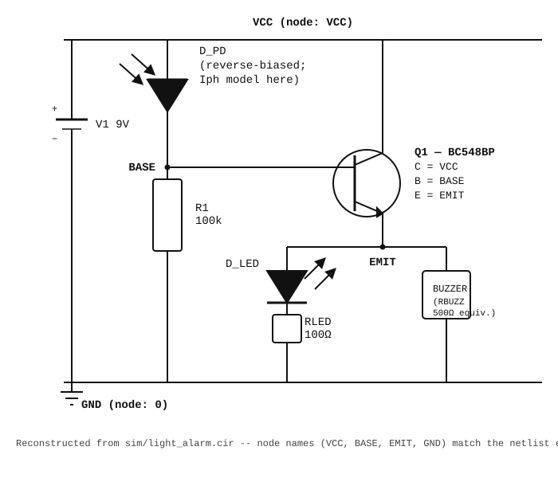

# Light Sensing Security System (IR Photodiode Circuit)

## Project Overview

A simple analog circuit -- an IR photodiode biasing a BC548 transistor
that switches an LED and buzzer -- built as a breadboard prototype for
**21ECC101J -- Electronic System and PCB Design**, Semester II
(2023-24 Even), Department of Electronics and Communication
Engineering, SRM Institute of Science and Technology. The original
report is at
[`docs/PCB MINI PROJECT.pdf`](docs/PCB%20MINI%20PROJECT.pdf).

This repo doesn't just re-describe the report -- it actually **simulates
the circuit** (LTspice) to check the report's own claims against the
circuit's real, modeled behavior.

## Key Finding

| | Trigger condition claimed / found |
|---|---|
| **Original report's Introduction** | Light **decreasing** (an obstruction blocking the beam) triggers the alarm -- an obstruction/beam-break detector. |
| **Actual modeled circuit** (this repo, confirmed by simulation) | Light **increasing** triggers the alarm -- the *opposite* condition, matching a flame/light-increase detector instead. |

The report's own Background section and demo photos agree with the
circuit's actual behavior, not the Introduction's framing. A person
blocking the light in this circuit would turn the alarm **off**, not
trigger it. Confirmed with real simulation data, not just circuit-theory
argument -- full evidence:
[`docs/verification-log.md`](docs/verification-log.md#finding-the-report-describes-two-different-and-contradictory-trigger-conditions).

## Original Project vs. My Contribution

This was originally a **team project** submitted by four students for
21ECC101J. The original circuit design, breadboard build, and report
([`docs/PCB MINI PROJECT.pdf`](docs/PCB%20MINI%20PROJECT.pdf)) are the
team's collective work -- this repository does not claim sole authorship
of the original design or build.

**What this repository adds, specifically performed by B.V. Balanilavan**:
reconstructing the circuit as a real, citable SPICE simulation,
verifying the sign conventions and models used rather than assuming
them, finding and documenting the Key Finding above (with simulated
evidence), attempting CI and honestly documenting why it doesn't
currently work rather than hiding or faking it, and writing this repo's
documentation.

## Circuit Overview



Photodiode (reverse-biased) -> 100k bias resistor -> BC548 (as a
current-amplifying switch) -> LED + 100 ohm resistor + buzzer. More IR
light on the photodiode increases its current, which raises the
transistor's base voltage and turns on the LED/buzzer. Full topology
and component-by-component explanation:
[`docs/circuit-analysis.md`](docs/circuit-analysis.md).

## What Was Found

1. **The report describes two contradictory trigger conditions.** Its
   Introduction frames this as detecting an *obstruction* (a person
   blocking light -- i.e. light *decreasing* triggers the alarm), but
   its Background section and demo photos describe and show a *flame/
   light-increase* detector -- the opposite condition. Confirmed by
   simulation, not just circuit-theory argument: see
   [verification-log.md](docs/verification-log.md#finding-the-report-describes-two-different-and-contradictory-trigger-conditions).
2. **This is a breadboard build, not a "fabricated PCB.**" The report
   captions its photos "fabricated pcb assembly" and describes
   "precise soldering," but the photos show a solderless breadboard
   (MB102). See
   [verification-log.md](docs/verification-log.md#secondary-finding-this-is-a-breadboard-build-not-a-fabricated-pcb).

Neither finding disputes that the physical circuit works or that the
photos are genuine -- both are about the report's own narrative not
matching what it actually built and photographed.

## Simulation Results

Real output from `sim/run.ps1` (LTspice 26.0.2, re-run and captured for
this README, not illustrative):

```
   Iph (A) |  V(base) (V) |  V(emit) (V) |   I(LED) (A) |   Ic(Q1) (A) | State
------------------------------------------------------------------------------------------
  0.00e+00 |       0.0004 |       0.0000 |   1.0341e-20 |   9.1944e-12 | OFF (dark / below threshold)
  1.00e-06 |       0.1004 |       0.0000 |   8.4562e-19 |   1.0054e-11 | OFF (dark / below threshold)
  1.00e-05 |       0.8366 |       0.2216 |   8.3347e-10 |   4.4150e-04 | OFF (dark / below threshold)
  3.00e-05 |       2.0596 |       1.3935 |   1.4960e-04 |   2.9272e-03 | DIM (transitioning)
  1.00e-04 |       3.8173 |       3.0901 |   1.2817e-02 |   1.8935e-02 | ON (LED visibly lit)
  1.00e-03 |       9.5725 |       8.7548 |   6.7833e-02 |   8.4916e-02 | ON (LED visibly lit)
```
(Abbreviated -- full 12-step sweep in
[verification-log.md](docs/verification-log.md#simulation-results).)
Dark state is fully off; the LED reaches typical real operating current
only once the modeled photocurrent (`Iph`) reaches roughly 100uA, with a
gradual (not sharp) transition -- this circuit has no hysteresis, so a
real build could flicker near the threshold rather than switch cleanly.


The simulated transition region is roughly **10uA-100uA** of modeled
photocurrent -- this describes the *assumed photocurrent model* used in
this simulation, not a measured threshold of the real, physical
photodiode (no specific part number was given in the report to source
real photocurrent-vs-illuminance data for).

## Verification Matrix

| Claim | Status |
|---|---|
| Circuit is fully off at `Iph=0` (dark) | **Confirmed** -- simulation, `I(LED)` ~1e-20 A |
| LED/buzzer activation increases monotonically with `Iph` | **Confirmed** -- simulation, full 12-point sweep |
| Report's Introduction (obstruction/beam-break) matches this circuit's actual behavior | **Not supported** -- simulation shows the opposite trigger condition |
| Report's Background/photos (light-increase) match this circuit's actual behavior | **Confirmed** -- consistent with simulation |
| "Fabricated PCB" / "precise soldering" as captioned in the report | **Not supported** -- report's own photos show a solderless breadboard (MB102) |
| Real photodiode's actual photocurrent-vs-illuminance response | **Not verified** -- no part number given; `Iph` is a modeled stand-in range, not measured |
| Physical breadboard build's real light-level transition threshold | **Not verified** -- no lux-meter measurement was taken against this simulation |
| Buzzer's real electrical/acoustic behavior | **Not verified** -- modeled as a plain resistor, an explicit simplification |
| Continuous integration (automated re-simulation on push) | **Not currently supported** -- attempted, root cause not found; see below |

## Technologies

- **LTspice** (Analog Devices) -- circuit simulation, batch mode
- **Python 3** (standard library only) -- parses simulation output
- **PowerShell** -- drives the simulation + parser

## Repository Structure

```
sim/
  light_alarm.cir     The SPICE netlist (real circuit reconstruction)
  run.ps1              Runs the simulation and prints the results table
  parse_results.py     Parses LTspice's .raw output into that table
docs/
  PCB MINI PROJECT.pdf   Original team project report
  circuit-analysis.md    Topology, SPICE models used, and why
  verification-log.md    The findings, with evidence -- including the CI attempt
  interview-questions.md Interview prep grounded in this project
  schematic/              Reconstructed circuit schematic (SVG)
  plots/                  Simulation result plots (SVG)
```

## Requirements

[LTspice](https://www.analog.com/en/design-center/design-tools-and-calculators/ltspice-simulator.html)
(free, Windows/macOS) and Python 3 (standard library only). Verified
against LTspice 26.0.2 on Windows. **Not verified in CI** -- see
[Continuous Integration](#continuous-integration) below for why.

## Installation

```bash
git clone https://github.com/FURYBALA/LightSensingSecuritySystem.git
cd LightSensingSecuritySystem
winget install --id=AnalogDevices.LTspice -e
```

## Running the Simulation

```powershell
powershell -File sim/run.ps1
```

Expected output: `Using LTspice: <path>`, then the same 12-row
`Iph / V(base) / V(emit) / I(LED) / Ic(Q1) / State` table shown in
[Simulation Results](#simulation-results) above. Add `-Check` to also
run the regression check and exit non-zero on failure:

```powershell
powershell -File sim/run.ps1 -Check
```

Expected output: the same table, followed by `Dark point: ...`,
`Bright point: ...`, and a final `REGRESSION CHECK: PASS` line (dark
point off, brightest point clearly on). These are the actual commands
and output this repo was verified against -- no other invocation has
been tested.

## Verification

The simulation table above is real solver output (LTspice batch mode,
`-b -ascii`), not a hand-typed expectation. Component models used are
either real, citable manufacturer/library SPICE models (BC548, the
photodiode's diode junction) or explicitly-labeled generic
approximations where the report gives no part number (the LED, the
buzzer) -- see the model-by-model table in
[`docs/circuit-analysis.md`](docs/circuit-analysis.md#spice-model-whats-real-and-whats-approximated).
The SPICE current-source sign convention used to model the photodiode's
photocurrent was verified with a standalone two-line test netlist
before being trusted in the real circuit, not assumed from memory.

## Continuous Integration

**Attempted, and honestly not working -- no CI badge or workflow file
in this repo.** Across five isolated diagnostic runs on GitHub Actions'
`windows-latest` runner, `LTspice.exe -b` was confirmed to never
complete -- even for a trivial single-resistor netlist -- for reasons
not fully identified, after ruling out a slow-download bug and an
install-path assumption (both fixed/ruled out along the way). Rather
than keep a permanently-failing badge, the workflow was removed. Full
run-by-run account:
[`docs/verification-log.md`](docs/verification-log.md#ci-attempted-and-honestly-not-working).
This doesn't affect the simulation results above, which are real and
locally reproducible.

## Limitations

Stated plainly:
- **No specific photodiode or LED part number was given in the
  report**, so the simulated photocurrent range and the LED's forward-
  voltage model are engineering approximations, not measurements
  against a real component's datasheet.
- **The buzzer is modeled as a plain resistor** -- not a real
  electrical/acoustic model of a piezo or magnetic buzzer.
- **This simulation does not re-verify the physical breadboard
  build's actual measured behavior** -- the report's own demo photos
  are its independent evidence of that; this repo adds a separate,
  independent circuit simulation on top, not a re-measurement of the
  physical prototype.
- **No PCB fabrication was performed here or in the original
  report** -- despite the report's own "fabricated PCB" captioning,
  the demonstrated build is a solderless breadboard (MB102).

## Future Improvements

Realistic, not aspirational:
1. Source real datasheets for a specific photodiode and LED part
   number, and re-run the simulation with their actual SPICE models
   (or datasheet curves) instead of generic approximations.
2. Measure the physical breadboard build's real light-level threshold
   with a lux meter, and compare against this simulation's transition
   region.
3. If an obstruction/beam-break detector is genuinely wanted (matching
   the report's Introduction), redesign the trigger condition (e.g.
   invert the sense, or add a comparator referenced to a "beam present"
   baseline) rather than reusing this flame-detection-style topology.
4. Actually root-cause why `LTspice.exe -b` doesn't complete on GitHub
   Actions' Windows runners (e.g. by testing with Process Monitor on a
   comparable local VM), so CI can be re-added for real rather than
   removed.

## Resume-ready project description

- Reconstructed a team-built analog security-alarm circuit
  (photodiode/BC548/LED) as a real LTspice simulation, using citable
  manufacturer SPICE models where available and clearly-labeled
  generic approximations where the original report specified no part
  number.
- Found and documented a real inconsistency between the report's
  stated use case (obstruction/beam-break detection) and the circuit's
  actual, simulated behavior (a light-increase/flame-detection
  response) -- confirmed with quantified simulation data across a
  12-point photocurrent sweep, not just circuit-theory argument.
- Verified the SPICE current-source sign convention empirically with a
  standalone test netlist before trusting it in the real circuit model.
- Attempted GitHub Actions CI, isolated the failure through five
  progressively-targeted diagnostic runs (a real download-speed bug,
  fixed; a batch-mode hang, not fixed), and documented the real finding
  instead of leaving a permanently-failing badge in place.

## Related projects

- [`CaesarCipher_LFSR_12Bit`](https://github.com/FURYBALA/CaesarCipher_LFSR_12Bit) -- Verilog/RTL, Icarus Verilog simulation
- [`LibraryManagement`](https://github.com/FURYBALA/LibraryManagement) -- Python/Tkinter/SQLite3, automated testing

## Interview Preparation

[`docs/interview-questions.md`](docs/interview-questions.md) -- analog
circuit design, SPICE simulation methodology, and software/verification
engineering questions, each grounded in this specific project.

## License

MIT -- see [LICENSE](LICENSE).

## Team

Built by a team of four for 21ECC101J at SRM Institute of Science and
Technology:

| Name | Registration No. |
|---|---|
| B.V. Balanilavan | RA2311053010123 |
| P. Sukesh | RA2311053010127 |
| K. Hemanth | RA2311053010128 |
| Keshav B.S. | RA2311053010144 |
